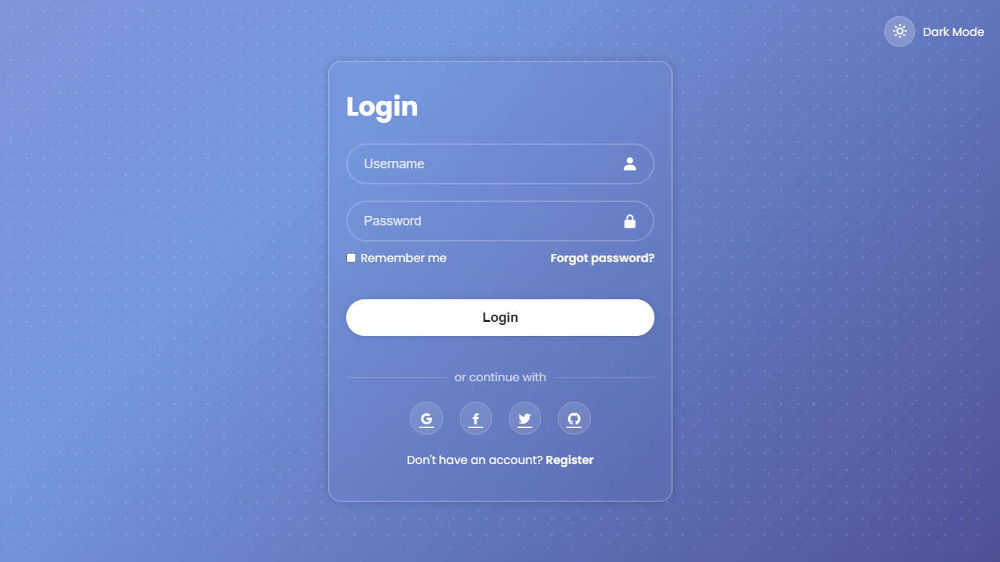

# Glassmorphism Login System

Modern responsive authentication UI with dark/light mode toggle and password strength indicator.



## Features
- Glassmorphism design effect
- Animated gradient background
- Theme switcher (dark/light mode)
- Password strength meter
- Form validation
- Responsive layout

## Installation
1. Clone repository:
   ```bash
   git clone https://github.com/yourname/glassmorphism-login.git
   cd glassmorphism-login
   
## Installation Dependencies
    npm install

## Start development server
    npm run dev

# Customization
    Edit these variables in scss/_variables.scss:
    // Color scheme
        $primary-color: #2b1055;
        $secondary-color: #7597de;

        // Glass effect
        $glass-blur: 15px;

# Project Structure
    /glassmorphism-login
    ├── /css
    ├── /js
    ├── /scss
    ├── index.html
    ├── register.html
    ├── forgot-password.html
    └── package.json

# License

    MIT Licensed. See LICENSE file for details.